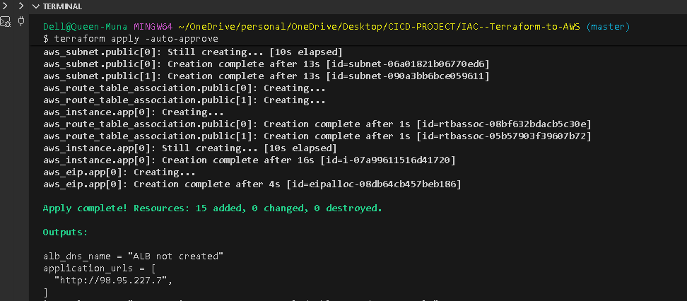
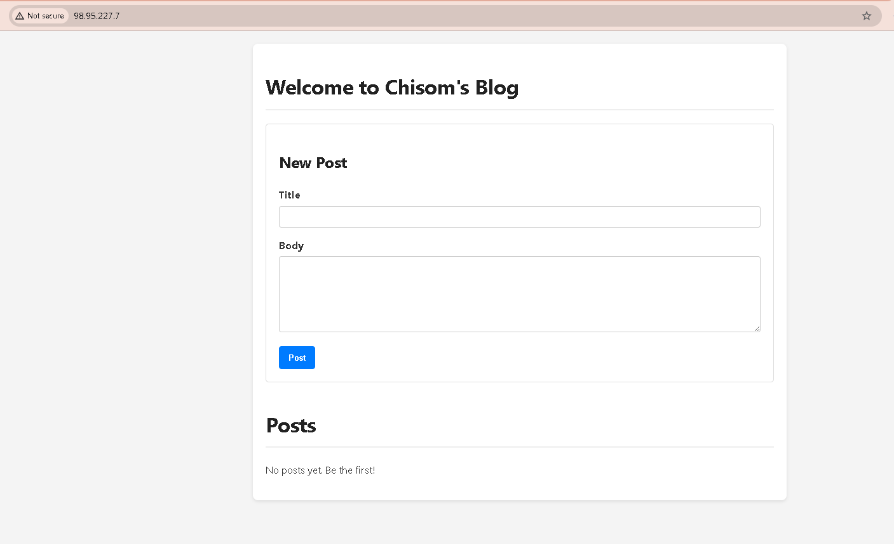

# MyBlogApp - Terraform Infrastructure

Deploy a Python Flask application on AWS using Terraform.

---

## Architecture

```
                        Internet
                            │
                            ▼
                    ┌───────────────┐
                    │Internet Gateway│
                    └───────┬───────┘
                            │
            ┌───────────────┴───────────────┐
            │        VPC (10.0.0.0/16)      │
            │                               │
            │  ┌─────────────────────────┐  │
            │  │     Public Subnets      │  │
            │  │  ┌───────┐  ┌───────┐   │  │
            │  │  │ AZ-1a │  │ AZ-1b │   │  │
            │  │  └───┬───┘  └───────┘   │  │
            │  └──────┼──────────────────┘  │
            │         │                     │
            │    ┌────▼────┐                │
            │    │   EC2   │                │
            │    │ + Nginx │                │
            │    │ + Flask │                │
            │    └─────────┘                │
            │                               │
            └───────────────────────────────┘
```

### Components Created

| Resource | Description |
|----------|-------------|
| VPC | Virtual network (10.0.0.0/16) |
| Public Subnets | 2 subnets across availability zones |
| Internet Gateway | Internet access for VPC |
| Security Group | Allows SSH (22), HTTP (80), HTTPS (443), App (5000) |
| EC2 Instance | Ubuntu 22.04 with Flask app |
| Elastic IP | Static public IP for EC2 |
| IAM Role | Permissions for EC2 instance |

### Application Stack (on EC2)

```
Nginx (port 80) → Gunicorn (port 5000) → Flask App
```

- **Nginx**: Reverse proxy, handles HTTP requests
- **Gunicorn**: Production WSGI server
- **Supervisor**: Process manager, auto-restarts app
- **Flask**: Your application

---

## Core Variables

| Variable | Description | Default |
|----------|-------------|---------|
| `aws_region` | AWS region to deploy | `us-east-1` |
| `project_name` | Name for resources | `myblogapp` |
| `environment` | Environment tag | `dev` |
| `instance_type` | EC2 instance size | `t2.micro` |
| `instance_count` | Number of EC2 instances | `1` |
| `app_port` | Port Flask runs on | `5000` |
| `github_repo` | Repository to clone | `https://github.com/ChisomJude/myblog.git` |
| `github_branch` | Branch to deploy | `master` |
| `allowed_ssh_cidr` | IPs allowed to SSH | `["0.0.0.0/0"]` |
| `create_alb` | Create load balancer | `false` |

---

## How to Run

### Prerequisites

- [Terraform](https://www.terraform.io/downloads) installed (>= 1.0)
- AWS account with access keys
- SSH key pair (`~/.ssh/id_rsa.pub`)

### Step 1: Connect to Your AWS Account

Export your AWS credentials:

```bash
export AWS_ACCESS_KEY_ID="your-access-key"
export AWS_SECRET_ACCESS_KEY="your-secret-key"
export AWS_REGION="us-east-1"
```

Verify connection:

```bash
aws sts get-caller-identity
```

### Step 2: Configure Variables

```bash
cd terraform
cp terraform.tfvars.example terraform.tfvars
```

Edit `terraform.tfvars` as needed:

```hcl
aws_region     = "us-east-1"
project_name   = "myblogapp"
environment    = "dev"
instance_type  = "t2.micro"
github_repo    = "https://github.com/ChisomJude/myblog.git" # or ur python app
github_branch  = "master"
```

### Step 3: Deploy Infrastructure

```bash
# Initialize Terraform
terraform init

# Preview changes
terraform plan

# Deploy
terraform apply or terraform apply -auto-approve
```

Type `yes` when prompted.

### Step 4: Access Your Application

Get the application URL:

```bash
terraform output application_urls
```


Open in browser: `http://YOUR_EC2_IP`




## Troubleshooting

### Check if app is running

```bash
# SSH into instance
ssh -i ~/.ssh/id_rsa ubuntu@YOUR_EC2_IP

#check the cloud logs
sudo cat /var/log/cloud-init-output.log

# Check app status
sudo supervisorctl status myblogapp

# View logs
sudo tail -f /var/log/myblogapp/error.log
```

### Common Issues

| Issue | Solution |
|-------|----------|
| Can't SSH | Check security group allows port 22 |
| App not loading | Check `sudo supervisorctl status` |
| 502 Bad Gateway | App crashed - check error logs |
| Database error | Run `flask init-db` manually |

---


## Clean Up

Destroy all resources when done:

```bash
terraform destroy
```

Type `yes` when prompted.

**This removes:**
- EC2 instance
- VPC and subnets
- Security groups
- Elastic IP
- All associated resources

---

